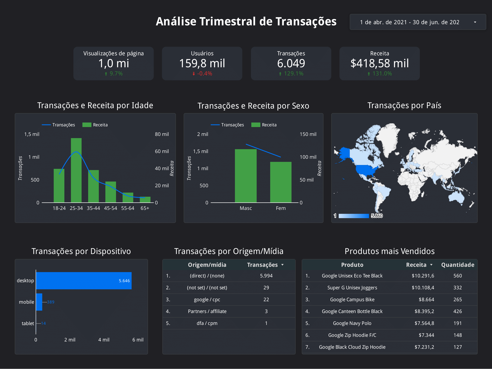

Abaixo é possível ver uma análise caracterizando o perfil do usuário que realiza compras na Google Merchandise Store. Podemos ver que esse público:
- Tem entre 18 e 44 anos
- Apresenta uma parcela maior de homens em relação a mulheres
- Reside nos Estados Unidos
- Realiza a maior parte das transações por desktop (computador)
- Vem de origem direta, o que pode significar que entrou no site diretamente digitando a URL no navegador, ou que ocorreu algum errou na hora da inserção dos parâmetros/ instalação do Google Analytics 
- Compra em sua maioria peças de vestuário

